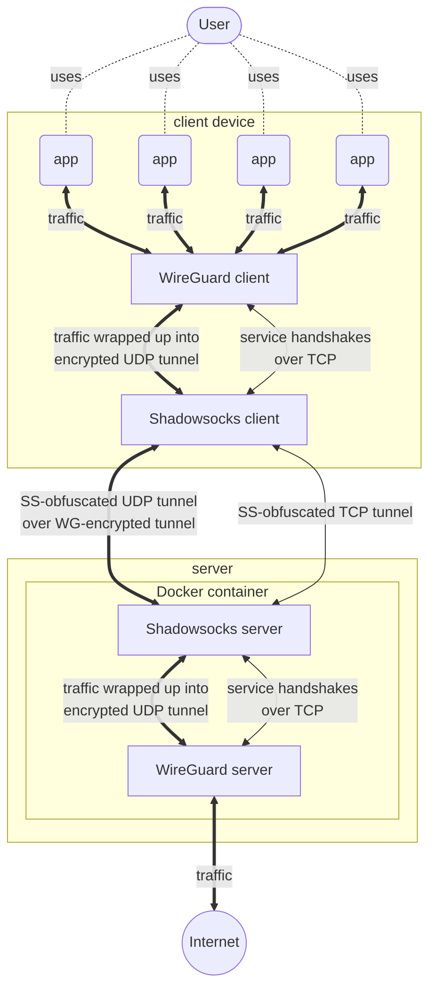

# WireGuard + Shadowsocks dockerized
WireGuard + Shadowsocks in Docker

## How it works
* WireGuard secure traffic wrapping it up to encrypted tunnel between client and server
* WireGuard uses TCP handshakes to establish connection, then data flows over UDP
* Unfortunately, WireGuard's TCP handshake is recognisable by specific signature of first bytes of package
* Shadowsocks obfuscate channel to mask fact that client trying to connect to  server via WireGuard
* You just need to wrap up you to Shadowsocks connection
* On client: put WG-encrypted traffic to SS-tunnel using SS-client's port
* On server: extract traffic from SS-tunnel and put it to WG-server's port



## Prequsites
* Server: Debian-based VPS, wget, make, Docker
* Client: WireGuard app, any Shadowsocks client app

## Typical usage
``` bash
apt-get install -y wget make
wget -O makefile https://raw.githubusercontent.com/chechulnikov/wg/main/makefile

# install dependencies
make install

# build Docker image, generate WireGuard ./wghub.conf config for server
make init

# setup firewall
make firewall

# generate new client's configs for names 'macbook', 'iphone', 'any-client-name', etc
make client CLIENT=macbook
make client CLIENT=iphone
make client CLIENT=any-client-name

# ... copy WireGuard clients configs from /wg directory and put it into your WireGuard client app
cat /wgss/wgclient_macbook.conf
cat /wgss/wgclient_iphone.conf
cat /wgss/wgclient_any-client-name.conf

# .. copy Shadowsocks client config and put it into your Shadowsocks client app
cat /wgss/ss-client.json

# run WireGuard + Shadowsocks server in Docker container
make run

# check status
make status
```

## Stop server
To stop server just use
```bash
make stop
```

## Clean all
To clean up your environment on server just use
```bash
make clean
```

## Help
For checking all available commands just type
```bash
make
```
